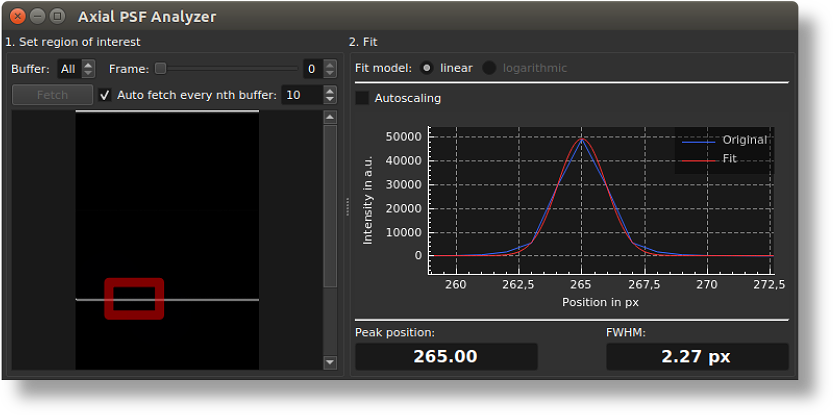

# Axial PSF Analyzer extension for OCTproZ
Axial PSF Analyzer is a plugin for [OCTproZ](https://github.com/spectralcode/OCTproZ). 

  

Axial PSF Analyzer can be used to measure the FWHM of the axial point spread function.   

## Notes
Set region of interest:
- The red ROI rectangle can be resized by dragging the upper left or bottom right corner.
- It is possible to zoom within the ROI selection display by CTRL + mousewheel.

Fit:
- It is possible to zoom in each axis direction independently by clicking on one of the axes, which highlights it blue, and then using the mousewheel for zooming.
- Double-clicking within the plot area will auto-scale the plot.

## License
Axial PSF Analyzer is licensed licensed under GPLv3. See [LICENSE](LICENSE).
